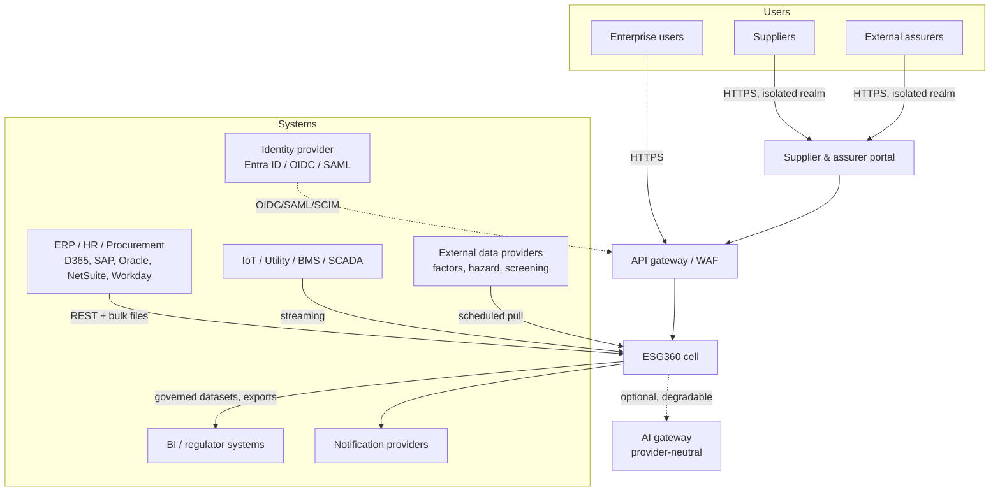
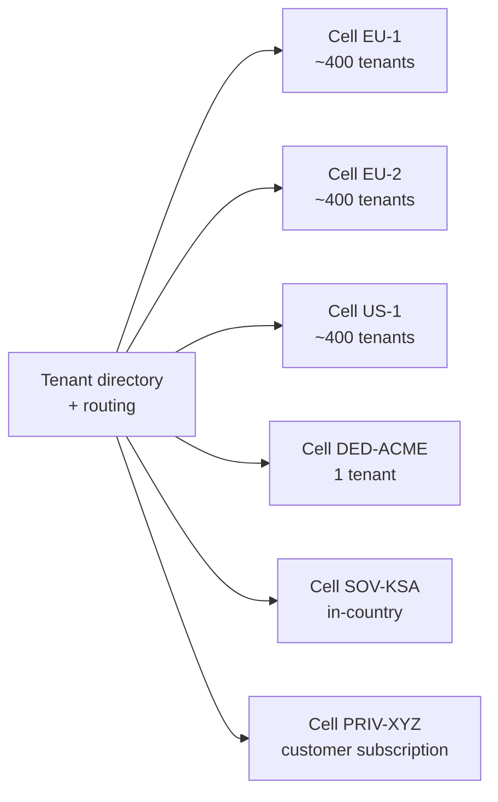

# ESG360 — Solution Architecture

> Companion to `specs/`. The specs say **what**; this says **how, and why not otherwise**.
> Individual decisions live in `docs/adr/`. This document is the narrative that connects them.
>
> Status: **proposed baseline** — ADR-0018, ADR-0002 and ADR-0017 need your sign-off before scaffolding.
>
> **Revision 2026-07-15:** stack reversed to Java after the team shape became known —
> ADR-0018 supersedes 0001, ADR-0019 supersedes 0009, ADR-0020 amends 0016. See `../V1-SCOPE.md`.

---

## 1. How to read this

Architecture is the set of decisions that are expensive to reverse. Everything else is
implementation detail and belongs in code, not documents. This document therefore covers
only the load-bearing choices, each traced to a requirement in `specs/`.

If a decision here isn't traceable to a spec requirement, it's over-engineering and should
be challenged. If a spec requirement isn't addressed here, that's a gap — raise it.

---

## 2. What actually shapes this system

Most "ESG platform" architectures on the internet are wrong for you, because they assume a
reporting tool. Your spec describes something closer to a **regulated accounting ledger that
happens to be about carbon**. Four requirements dominate every other consideration:

| Force | Source | Consequence |
|---|---|---|
| **Numbers must be defensible years later** | BR-002/003/004/005, BR-019, §38 | Determinism and immutability are structural, not features. Nothing overwrites. Every published number replays bit-identically. |
| **Four deployment profiles incl. sovereign & private cloud** | §28, NFR-015 | You cannot lean on any one cloud's proprietary managed services. Portability is a hard constraint, not a preference. |
| **10,000 tenants / 100,000 users / billions of records** | NFR-004 | Isolation must be cheap. Schema-per-tenant and DB-per-tenant are arithmetically dead on arrival. |
| **Audit evidence retained 7–10 years, tamper-evident** | NFR-012, §29, §31 | Append-only + WORM archival is a first-class subsystem, not a log table. |

Two more that constrain specific modules:

- **AI must never be load-bearing** (§42 "deterministic non-AI workflow remains available",
  BR-006). AI is an optional advisory sidecar. If the model provider is down, the product works.
- **Supplier/assurer are hostile-adjacent users** (BR-008, SUP-001). External portals are a
  separate blast radius, not a role flag.

### The one-line summary

> A **modular monolith** in **Java 21 / Spring Boot** over **PostgreSQL**, deployed as **independent cells**,
> where all ESG quantities are **decimal**, all controlled records are **append-only**, and
> every published number carries a **replayable manifest hash**.

---

## 3. Context



**Note the dotted line.** AI is the only external dependency the product can lose without
degrading a controlled workflow. That is deliberate and must stay true.

---

## 4. Deployment topology — cells

This is the decision that makes NFR-004 tractable and §28 possible at the same time.

**You do not scale one system to 10,000 tenants. You run many identical small systems.**

A **cell** is a complete, self-contained ESG360 deployment: app pods, PostgreSQL, object
storage, broker, cache. Same image, same schema, same migrations, everywhere.

| Profile (§28) | Cell allocation |
|---|---|
| Shared multi-tenant SaaS | ~250–500 tenants per cell → ~20–40 shared cells for 10k |
| Dedicated tenant SaaS | 1 tenant per cell |
| Sovereign cloud | 1 tenant (or 1 jurisdiction) per cell, in-country region |
| Private cloud | 1 cell in customer's subscription |
| Dev / test | Cells with synthetic or masked data only |



Why this is the right call for you specifically:

- **Residency becomes routing, not code.** NFR-008/§28 data residency is satisfied by
  *which cell* a tenant lives in. No application code knows about jurisdictions.
- **Dedicated/sovereign/private stop being special.** They are a cell with one tenant.
  Same binary. This is the difference between four products and one.
- **Blast radius is bounded.** A bad migration or a runaway tenant takes out 400 tenants,
  not 10,000. Directly serves NFR-001.
- **Canary is free.** Ship to one cell, watch, proceed. Serves §43's progressive delivery.
- **Tenant migration is a supported operation.** Shared → dedicated is an upsell path,
  and it's a data move, not a rewrite.

The cost, stated plainly: **you must never write code that assumes global cross-tenant
visibility.** Cross-tenant benchmarking (§19, R4) therefore cannot be a query — it needs a
separate anonymized aggregate pipeline (see §11 and ADR-0011). Accept this now; it is very
expensive to retrofit.

---

## 5. Module structure

Modular monolith per §35 ("modular monolith initially"), with the 12 module boundaries from
§36 enforced mechanically — not by good intentions.

```mermaid
graph TB
  subgraph Shared kernel — FKs allowed
    K[Tenant · OrganisationNode · ReportingPeriod<br/>MetricDefinition · Unit/Conversion]
  end
  subgraph Feature modules — no cross-module FKs
    CAT[Catalogue]
    COL[Collection]
    EVD[Evidence & Lineage]
    CAR[Carbon]
    ENV[Environmental]
    SOC[Social]
    GOV[Governance & Risk]
    SUP[Supplier ESG]
    TGT[Targets & Scenarios]
    DIS[Disclosure]
    INT[Integration]
    AIM[AI Orchestration]
  end
  subgraph Platform
    AUD[Audit — append-only]
    WF[Workflow]
    NOTM[Notification]
    SUB[Subscription & Metering]
  end
  CAT --> K
  COL --> K
  CAR --> K
  DIS --> K
  COL -.events.-> CAR
  CAR -.events.-> DIS
  SUP -.events.-> CAR
  CAT -.events.-> COL
```

Rules (enforced by architecture tests in CI — see ADR-0004):

1. One assembly per module. A module owns its PostgreSQL **schema**.
2. **No cross-module FKs**, except into the shared kernel.
3. No module reads another module's tables. Ever. Interface call or domain event only.
4. The shared kernel is deliberately tiny and slow-changing. Adding to it requires an ADR.

The shared kernel is the honest compromise. Making `OrganisationNode` eventually consistent
with `Submission` would be self-harm — every ESG record is scoped by org and period, and you
need DB-enforced referential integrity there (NFR-019). The price: **the shared kernel is the
thing that will resist later service extraction.** That is a known, accepted debt.

---

## 6. Tenancy and isolation

Three independent layers. Any one failing must not cause a leak — SEC-001 is a Critical-severity
defect (§50, zero open).

| Layer | Mechanism |
|---|---|
| **Physical** | Cell. Dedicated/sovereign tenants share nothing with anyone. |
| **Database** | PostgreSQL RLS. App role has **no `BYPASSRLS`**. `FORCE ROW LEVEL SECURITY` so even the owner is subject. Tenant set via `SET LOCAL app.tenant_id` per transaction (PgBouncer transaction-pooling safe). |
| **Structural** | Composite PK `(tenant_id, id)` on every business table; **every FK includes `tenant_id`**. A row physically cannot reference another tenant's row. |

That third layer is the one teams skip and regret. With composite FKs, cross-tenant
contamination is not "prevented by a check" — it is unrepresentable.

`id` is **UUIDv7** (time-ordered) for index locality on high-volume tables.

Tenant context is resolved **only** from the validated token (§37, §31). Any code path that
reads a tenant identifier from a request body, query string, or header is a defect.

---

## 7. Consistency model — what is ACID and what is not

NFR-019 demands ACID for controlled transactions. It does not demand ACID for everything,
and pretending otherwise would make the system unbuildable.

**Same transaction (ACID, no exceptions):**
- Business record change + its `AuditEvent` + its outbox row
- Any state transition of a controlled workflow (submission approve, period close, disclosure approve)
- Calculation result rows within one run's commit batch
- Within-module invariants

**Eventually consistent (via events, with explicit lag budgets):**
- Cross-module reactions (`SubmissionApproved` → Carbon recalculation trigger)
- Search index, vector index, analytics, notifications, AI
- Supplier score recomputation, dashboard aggregates

**Never consistent by design (deliberate divergence):**
- A `DisclosureSnapshot` and current live data. The snapshot is frozen (BR-003). Divergence
  is the feature — DIS-001 tests exactly this.

The transactional outbox (ADR-0008) is what makes the first bucket honest. Writing an audit
event or publishing an event *after* commit, outside the transaction, is a data-integrity bug
that will surface as unexplainable audit gaps years later. Don't.

---

## 8. The calculation engine — the crown jewel

This subsystem is why the product is defensible or worthless. Design it first, and don't let
any module reimplement any part of it.

### 8.1 Determinism model

> **manifest hash + engine version → identical output, forever.**

A **CalculationManifest** is the fully-resolved, serialized set of *every* input that can
affect the result:

```
tenant · boundary & consolidation method · reporting period
org hierarchy version        (effective-dated — ORG-001)
metric definition versions   (BR-014)
formula versions
factor versions              (FAC-002 — selected by validity date)
GWP set version              (AR4/AR5/AR6 — CAR-001)
unit conversion table version (BR-018)
allocation rules · rounding policy version
engine semantic version
```

Serialize canonically → SHA-256 → `manifest_hash`. Store it on the `CalculationRun`.

This gives you three things that are otherwise very hard:
- **Replay** (§38, BR-019): re-run the manifest. Output hash differs ⇒ engine regression.
- **Assurance**: "prove this number." Show the manifest, replay it live in front of the assurer.
- **CI regression gate**: the §49 validation datasets become golden manifests. Any engine
  change that alters a golden output hash fails the build. This single test is worth more
  than most of the rest of the QA suite.

### 8.2 Lineage without write amplification

The naive reading of §38 ("lineage edges to every input, factor and formula version") gives
you ~5 edge rows × 1M activity records = 5M rows per run. That is the design's biggest
performance trap, and it's avoidable.

**Leaf results carry lineage inline as columns**, not as edges:

```
calc_result(tenant_id, id, run_id,
            activity_id, factor_version_id, formula_version_id,
            gwp_set_id, conversion_id, allocation_ratio,
            gas, gas_mass, co2e, ...)
```

- "Where did this number come from?" → the row itself. One lookup.
- "Which results used factor X?" (required by §7 recalculation triggers) → index scan on
  `factor_version_id`. No edge table needed.
- **`lineage_edge` is used only for aggregate→child and disclosure→result** — orders of
  magnitude fewer rows.

Result: 1M activity records → ~1M result rows + a small edge set, instead of 6M rows.

### 8.3 Formula evaluation

Formulas are **user-authored metadata** (§4). So:

- **Restricted expression grammar → AST → interpreter.** Never `eval`, never dynamic
  compilation of tenant input, never generated SQL from tenant strings.
- The AST is required anyway: CAT-001 (circular reference detection) is a DAG cycle check
  over the formula graph at **publish** time, not run time.
- Published formula versions are immutable (BR-014). Compile/validate once at publish.

### 8.4 Throughput — does NFR-003 hold?

NFR-003: 1M activity records, monthly inventory, ≤60 min.

```
1,000,000 records / 3,600 s  = 278 records/sec sustained required
```

Per record: cached factor resolution + a handful of decimal ops + a row emit. A single worker
does thousands/sec; factor and conversion tables are small and cache fully in memory.
Partition by org-node/source across 8 workers, write via `COPY` in batches.

Realistic: **1M records in 2–6 minutes**, i.e. **10–30× headroom** against NFR-003.

The headroom exists *because* of §8.2. With naive edge writes you'd be writing 6M rows and
fighting the target. **The lineage model, not the compute, was the risk.**

### 8.5 Precision (see ADR-0006 — most-violated rule in practice)

- `decimal` end to end. **Never** `double`/`float`. Not "mostly" — never.
- Division is the only place precision is lost: pin **scale 12, MidpointRounding.ToEven**,
  versioned as part of the manifest's rounding policy.
- Rounding happens **only** at presentation/disclosure (BR-002), governed by a versioned policy.
- JSON serializes decimals **as strings** (§37 "without binary floating-point loss").
  A JSON number is IEEE-754 in most parsers — this is a silent, real corruption path.
- DB: `numeric`, never `float8`.

---

## 9. Immutability, audit and restatement

**Nothing that has been controlled is ever mutated.**

| Concept | Model |
|---|---|
| Submission correction | New revision supersedes; prior retained (§39) |
| Calculation correction | New run; prior run retained |
| Published disclosure | `DisclosureSnapshot`, frozen + hashed, with an evidence manifest of SHA-256s (§41) |
| Restatement (BR-005, CAR-004) | New snapshot + `Restatement` record → {original snapshot, reason, approval, threshold assessment}. Original stays readable forever. |
| Master data "deletion" (BR-012) | Inactivation only |
| Period close (COL-003, BR-013) | Status flag enforced by **DB trigger**, not only app code. Reopen is a privileged, reasoned, audited action. |

**Audit log** (NFR-012, §29):
- Append-only table, monthly partitions. `UPDATE`/`DELETE` grants **revoked** from the app role.
- **Hash chain**: each event stores `prev_hash`; chain head published periodically to
  object storage with **object-lock (WORM)**. That is tamper *evidence* at near-zero cost.
- Archive closed partitions to object-lock storage for the 7–10y horizon; keep hot data small.
- Not a blockchain. A hash chain plus WORM gives you the same auditor-facing property.

---

## 10. Security model

Layered per §31, but the two decisions that matter most:

**Supplier and assurer portals are a separate deployable application** with their own auth
realm — not a role inside the internal app. Rationale: BR-008/SUP-001 are Critical-severity;
a single authorization bug in a shared app leaks buyer internal notes to a supplier. Separate
app = separate blast radius, smaller attack surface, independently pen-testable, and the
supplier session can never hold internal scopes at all.

**Isolation is tested continuously, not reviewed.** SEC-001/SUP-001 style tests
(tenant A token + tenant B ID; supplier A + supplier B resource) run on **every module merge**,
not once per release. Add a fuzzer that walks every endpoint with a foreign tenant's IDs.

Everything else follows §31 conventionally: TLS 1.2+, envelope encryption with customer-managed
keys for dedicated/sovereign, secrets vault, SAST/DAST/SBOM in CI (§43), private endpoints,
break-glass with PIM.

---

## 11. Analytics and the benchmarking trap

Dashboards (§19, R1) → **read replicas + materialized views** in the same cell. Defer the
lakehouse (§29). Introducing bronze/silver/gold before you have users is the classic
premature-platform mistake, and a lakehouse spanning cells contradicts §4's residency model.

**Cross-tenant benchmarking (§19, R4) is architecturally special and must be designed, not
grown.** Under RLS and cell isolation it is *impossible by construction* — which is correct.
It requires a deliberate, opt-in, anonymized aggregate export from each cell into a separate
benchmarking store, with k-anonymity thresholds (consistent with BR-007's privacy-threshold
philosophy) and contractual consent. Treat it as a distinct product with its own DPIA.

Do not let anyone "just add a cross-tenant query" — it would silently dismantle §4 and §6.

---

## 12. AI containment (§42, AI-001/002/003)

AI is a **sidecar behind a gateway interface**, never in a transactional path, always
disable-able (§42 fallback requirement).

The structural stance on prompt injection (AI-002 is an explicit test case, and evidence
files are *attacker-controlled content* — a supplier can upload a PDF):

1. **Tenant content is data, never instructions.** Retrieved evidence enters a data channel;
   it is never concatenated into the system prompt.
2. **No tools granted to summarization/narrative flows.** An injected "call the export tool"
   has nothing to call.
3. **Structured output only** — JSON schema validated; non-conforming output rejected.
4. **Citation provenance filter** — every cited source ID must resolve to a document the
   requesting user is authorized for, else the whole output is rejected (AI-001).
5. **Egress classification gate** — restricted/PII classes never leave to external models
   (AI-003); routing by data class is the gateway's job.
6. **Human review queue** — no material auto-publication (BR-006).
7. **No training on tenant data by default**; per-tenant vector namespaces; encrypted embeddings.

---

## 13. Performance budget

| NFR | Target | Design headroom |
|---|---|---|
| NFR-002 | p95 read <2.5s, save <3s | Comfortable. Per-cell load is ~5k users, not 100k. This is the cell model paying off. |
| NFR-003 | 1M records ≤60 min | ~10–30× headroom (§8.4) — *contingent on the §8.2 lineage model* |
| NFR-004 | 10k tenants, 100k users, billions of rows | Via cells + declarative partitioning by `(tenant, period)`; no single DB carries the whole estate |
| NFR-005/006 | RPO ≤15 min, RTO ≤4h | PITR + streaming replica per cell; recovery order per §34 (identity → records → evidence → workflow → integration → analytics → AI) |
| NFR-001 | 99.9% | Multi-zone per cell; cell failure ≠ platform failure |

Load-test NFR-002/003 from Release 0, against representative volumes (§43 point 40). A
performance target first measured in Release 3 is a target you will miss.

---

## 14. Evolution triggers

Architecture is a set of decisions plus the conditions under which you'd revisit them.
These are the tripwires — not aspirations.

| Trigger | Action |
|---|---|
| A module needs independent scaling or release cadence | Extract it to a service. Boundaries (§5) already permit it. Carbon and Integration are the likely first candidates. |
| Meter/IoT ingest sustained rate or storage cost dominates | Split time-series to a dedicated store (ADR-0010) |
| Analytics queries degrade OLTP p95 | Introduce the lakehouse (ADR-0011) |
| Cell count exceeds ~5, or first private/sovereign customer, or first SRE hire | Adopt Kubernetes deliberately (ADR-0020) |
| First service extracted from the monolith | Introduce a message broker (ADR-0017) |
| Cell exceeds ~500 tenants or its DB exceeds comfortable operational size | Split the cell |
| Cross-tenant benchmarking is contracted | Build the anonymized pipeline (§11), never a cross-tenant query |

---

## 15. Top architectural risks

| Risk | Why it's serious | Mitigation |
|---|---|---|
| A `double` leaks into a calculation path | Silent, produces defensible-looking wrong numbers; Critical per §50 | Ban the type in lint/analyzer; architecture test asserting no float in domain assemblies; golden-dataset hash gate |
| Lineage write amplification | Quietly breaks NFR-003 at real volumes | §8.2 inline-lineage model; load test at 1M from R0 |
| Shared kernel grows | Kills future extraction; the monolith becomes irreversible | Kernel additions require an ADR; architecture test on kernel assembly size/deps |
| Flowable's tables sit outside our RLS model | Workflow state (not ESG records) could leak under a wrapper bug | Mandatory `tenantId` injection in the Workflow module interface; isolation tests over workflow queries (ADR-0019) |
| Team is junior vs §52's assumed staffing | Regulated methodology errors look identical to correct output | Carbon-accountant and security gates in `../V1-SCOPE.md` — gates, not advice |
| Cross-tenant leak | Critical severity, existential commercially | Three independent layers (§6); isolation tests on every merge |
| Prompt injection via supplier-uploaded evidence | Attacker-controlled input reaching an LLM with tool access | §12's structural stance — no tools, data channel, provenance filter |
| Effective-dated hierarchy correctness (ORG-001) | Subtly corrupts *all* historical comparatives | Temporal model in the shared kernel from day 1; never bolt on later |

---

## 16. Decision index

| ADR | Decision | Confidence |
|---|---|---|
| ~~[0001](adr/0001-backend-platform.md)~~ | ~~.NET 8 LTS~~ | ⛔ Superseded by 0018 |
| [0002](adr/0002-relational-database.md) | PostgreSQL 16+ | **High** — forced by §28 portability |
| [0003](adr/0003-tenancy-and-cells.md) | Shared schema + RLS + cell topology | **High** |
| [0004](adr/0004-modular-monolith.md) | Modular monolith, schema-per-module, small shared kernel | **High** |
| [0005](adr/0005-calculation-engine.md) | Manifest-hash determinism, AST evaluator, inline lineage | **High** |
| [0006](adr/0006-precision-and-rounding.md) | Decimal everywhere, strings over JSON, pinned rounding | **High** |
| [0007](adr/0007-audit-log.md) | Append-only partitions + hash chain + WORM archive | High |
| [0008](adr/0008-transactional-outbox.md) | Transactional outbox for audit + domain events | **High** |
| ~~[0009](adr/0009-workflow-engine.md)~~ | ~~Custom state machine; defer BPMN~~ | ⛔ Superseded by 0019 |
| [0010](adr/0010-time-series.md) | Native partitioning in PostgreSQL; defer dedicated TSDB | Medium |
| [0011](adr/0011-analytics.md) | Read replicas + matviews; defer lakehouse; benchmarking is separate | High |
| [0012](adr/0012-evidence-storage.md) | Content-addressed object storage, quarantine, object-lock holds | High |
| [0013](adr/0013-ai-containment.md) | Gateway sidecar, untrusted-content model, human review | **High** |
| [0014](adr/0014-api-contract.md) | Contract-first OpenAPI, idempotency, cursor pagination | High |
| [0015](adr/0015-frontend.md) | Next.js self-hosted; separate supplier/assurer portal app | Medium |
| [0016](adr/0016-deployment-and-residency.md) | Cell-based residency and canary (runtime amended by 0020) | High |
| [0017](adr/0017-toolchain.md) | Toolchain — GH Actions, Terraform, Flyway, jOOQ, Testcontainers | High |
| [0018](adr/0018-backend-platform-revised.md) | **Java 21 + Spring Boot 3 + Flowable** | Medium-High |
| [0019](adr/0019-workflow-revised.md) | **Flowable embedded** | **High** |
| [0020](adr/0020-runtime-platform-revised.md) | **Managed containers; defer Kubernetes** | High |

---

## 17. What this document deliberately does not decide

- Component library / design system choice (reversible, R0 detail)
- Broker: deferred entirely for v1 — outbox dispatches in-process (ADR-0017)
- Search: OpenSearch vs managed (behind an interface; not load-bearing)
- ~~Test framework, CI vendor, IaC tool~~ — now decided in ADR-0017
- Anything in §53 (out of scope for the product baseline)
